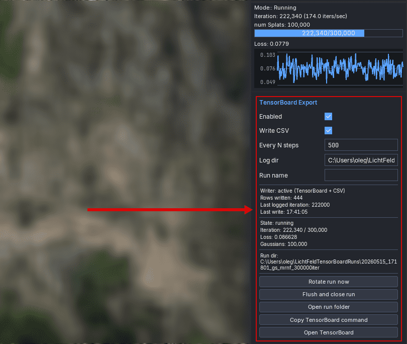
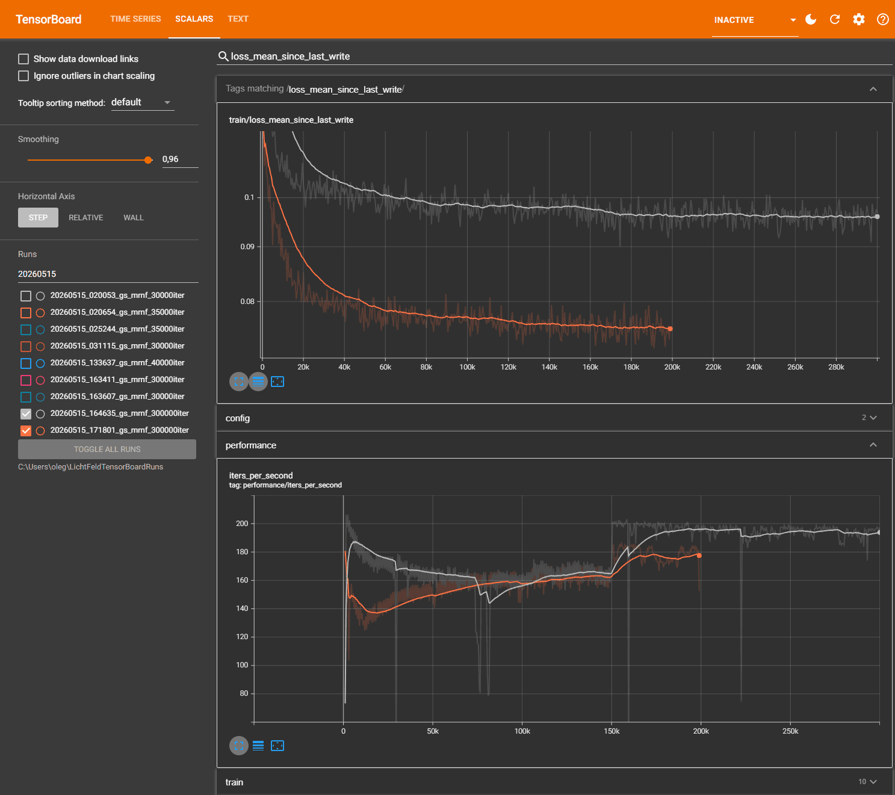

# TensorBoard Export for LichtFeld Studio

TensorBoard Export is a LichtFeld Studio plugin that writes full training metrics from the training lifecycle hooks to TensorBoard-compatible event files and CSV.

It exists because LichtFeld Studio's built-in loss plot is intentionally short-lived UI state. This plugin records the training signal at the source, so long runs can be inspected later in TensorBoard or external analysis tools.

## Features

- Writes TensorBoard event files via `tensorboardX`.
- Writes `metrics.csv` next to each event file run.
- Writes `config.json` with plugin/schema version, trainer state, dataset params, and optimization params.
- Starts a new unique run automatically on training start.
- Flushes and closes the current run on training end.
- Exposes plugin UI controls for status, run rotation, folder opening, TensorBoard command copying, and TensorBoard URL opening.
- Avoids known empty metrics: `train/progress` is written only when max iterations are known, and PSNR is not exported because this LichtFeld runtime commonly reports it as an empty zero signal.

## Screenshots

LichtFeld export panel:



TensorBoard dashboard:



## Requirements

- LichtFeld Studio `>=0.4.2`
- LichtFeld plugin API `>=1,<2`
- Python `>=3.12`
- `tensorboardX` is used by the plugin for event file writing.
- TensorBoard itself must be installed and started separately.

## Installation

Clone this repository into LichtFeld's plugin directory with the plugin directory name `tensorboard_export`:

```powershell
git clone https://github.com/Dok11/lichtfeld-tensorboard-export.git "$env:USERPROFILE\.lichtfeld\plugins\tensorboard_export"
```

On Linux/macOS:

```bash
git clone https://github.com/Dok11/lichtfeld-tensorboard-export.git ~/.lichtfeld/plugins/tensorboard_export
```

The plugin directory must contain `pyproject.toml` and `__init__.py` at its root.

To update an existing installation:

```powershell
cd "$env:USERPROFILE\.lichtfeld\plugins\tensorboard_export"
git pull
```

On Linux/macOS:

```bash
cd ~/.lichtfeld/plugins/tensorboard_export
git pull
```

Then validate it from the directory that contains `LichtFeld-Studio.exe`:

```powershell
$env:PYTHONUTF8='1'
.\LichtFeld-Studio.exe plugin check tensorboard_export
```

`PYTHONUTF8=1` works around a Windows plugin validator issue where dependency files inside `.venv` can be read with the legacy console code page.

## Usage

1. Open LichtFeld Studio.
2. Open the plugin manager and load `tensorboard_export`.
3. In the `TensorBoard Export` panel, enable `Enabled`.
4. Start training.
5. The plugin automatically creates a new run directory and starts writing metrics.

Default output directory:

```text
%USERPROFILE%\LichtFeldTensorBoardRuns
```

Run TensorBoard separately:

```powershell
py -m pip install tensorboard
tensorboard --logdir "$env:USERPROFILE\LichtFeldTensorBoardRuns" --port 6006
```

Then open:

```text
http://localhost:6006/?darkMode=true
```

`Open TensorBoard` opens the browser URL only. It does not start the TensorBoard server.

## Panel Controls

- `Enabled`: enables automatic logging.
- `Write CSV`: writes `metrics.csv` next to the TensorBoard event files.
- `Every N steps`: controls how often values are written to disk.
- `Log dir`: root directory for TensorBoard runs.
- `Run name`: optional custom run name. Leave empty for an automatic name.
- `Rotate run now`: closes the current writer and starts a new unique run directory.
- `Flush and close run`: flushes event files and CSV, then closes the current run.
- `Open run folder`: opens the current run directory in Explorer.
- `Copy TensorBoard command`: copies the TensorBoard command for the configured log root.
- `Open TensorBoard`: opens `http://localhost:6006/?darkMode=true`.

## Run Naming

Automatic run names use:

```text
YYYYMMDD_HHMMSS_<dataset>_<strategy>_<iterations>iter
```

Fields are omitted when LichtFeld does not expose them. If a directory already exists, the plugin appends a numeric suffix.

## TensorBoard Tags

Loss:

- `train/loss_raw`: instantaneous loss at the logged iteration.
- `train/loss_mean_since_last_write`: average loss across steps observed since the previous write.
- `train/loss_min_since_last_write`: minimum loss since the previous write.
- `train/loss_max_since_last_write`: maximum loss since the previous write.
- `train/loss_ema_100`: exponential moving average updated every training step and written every `Every N steps`.
- `train/loss_ema_500`: slower exponential moving average updated every training step and written every `Every N steps`.

Training:

- `train/num_gaussians`
- `train/progress`

Performance:

- `performance/iters_per_second`

Trainer:

- `trainer/elapsed_seconds`
- `trainer/eta_seconds`

Config:

- `config/session` text summary

## Run Files

Each run directory contains:

```text
events.out.tfevents...
metrics.csv
config.json
```

`config.json` includes:

- `schema_version`
- `plugin_version`
- `trainer_state`
- `strategy_type`
- `max_gaussians`
- `total_iterations`
- `optimization_params`
- `dataset_params`

## Known Limitations

- TensorBoard must be started separately.
- Old TensorBoard event files keep old tags after plugin upgrades. Create a new run for a clean dashboard.
- `train/progress` appears only when total iterations are available through the runtime.

## Development Checks

From the directory that contains `LichtFeld-Studio.exe`:

```powershell
$env:PYTHONUTF8='1'
.\LichtFeld-Studio.exe plugin check tensorboard_export
```

From this plugin directory:

```powershell
.\.venv\Scripts\python.exe -m py_compile .\__init__.py
```
