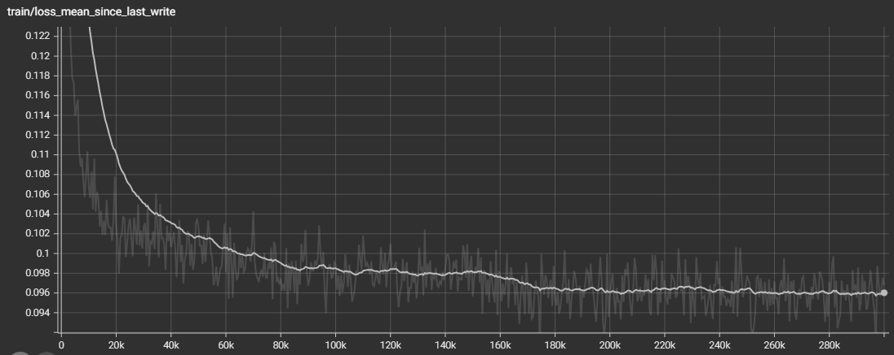
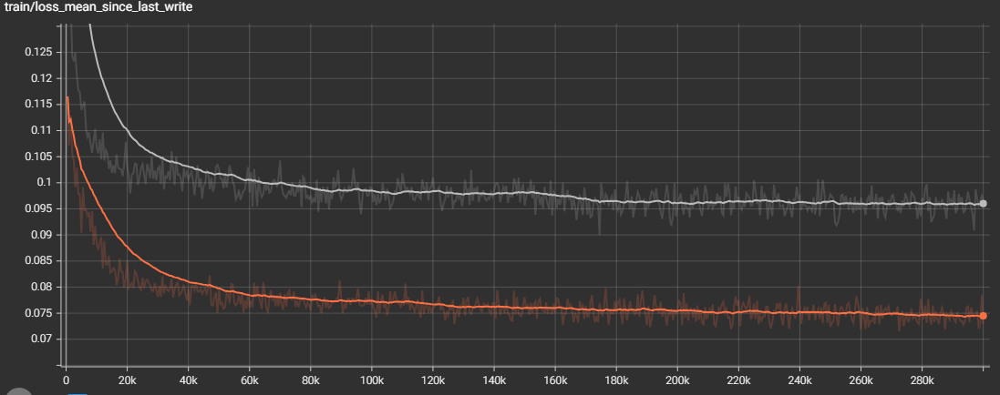
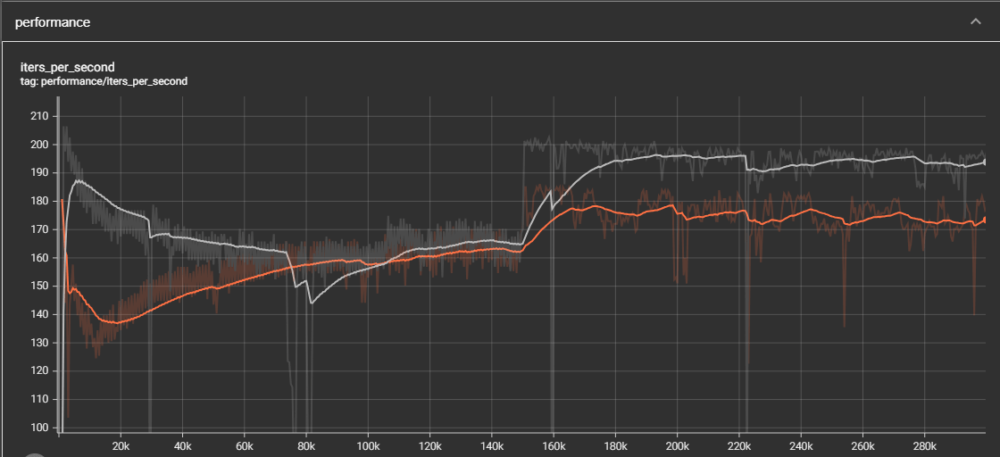
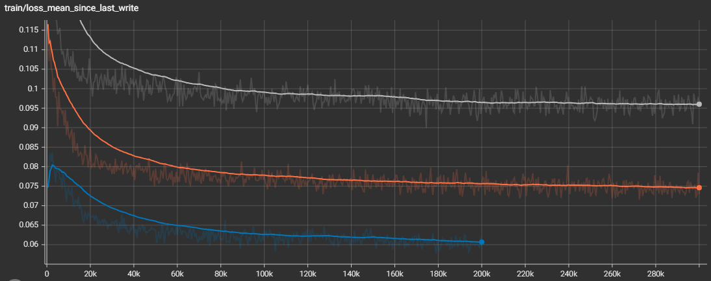
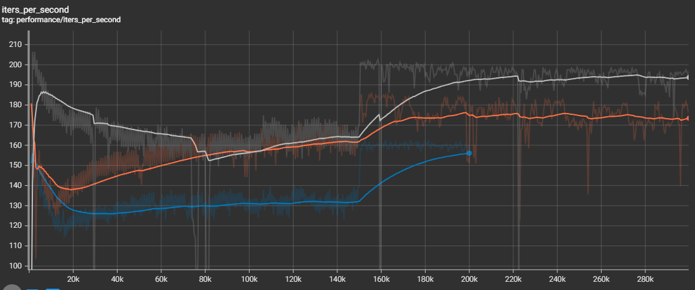
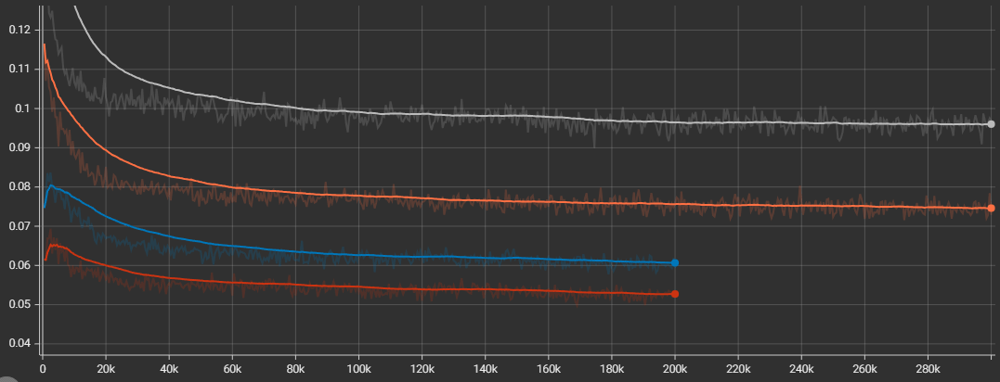
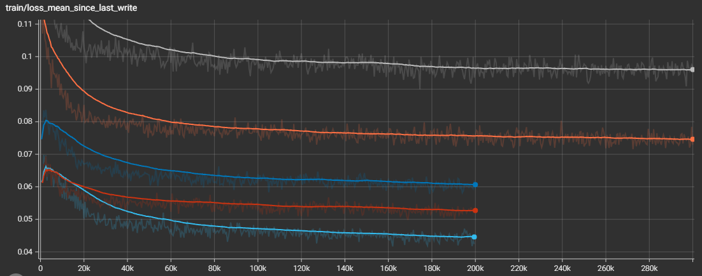
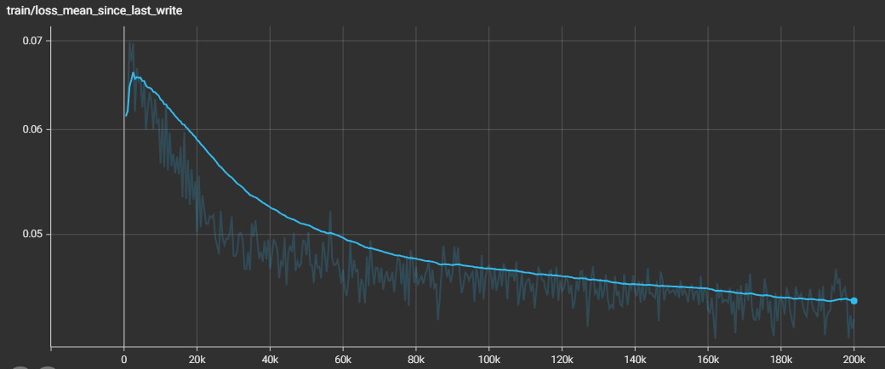

# How to Use Loss Curves in LichtFeld Studio

TensorBoard is useful here not because the visualization is fancy, but because it helps with two practical things:

- you can inspect metrics across the full training horizon, from the first iteration to the last one;
- you can compare several runs on one chart and make decisions from data instead of relying on LichtFeld Studio's short built-in loss plot.

## Goal

Suppose you need to understand how many splats are worth allocating to a scene and how many iterations are actually worth running. I usually do this as a series of runs: start with a low splat limit, look at the loss floor, then increase the limit and compare how much the loss improved and how much more expensive the run became.

The example below uses this scene: [superspl.at/scene/5f03cdcb](https://superspl.at/scene/5f03cdcb).

## First Run: Few Splats, Many Iterations

The first run is useful with a small number of splats and a large number of iterations. This shows the approximate error floor the scene can reach with that budget.

For this mode, it is important to use the target loss. For example, if the final scene is built from 4K video and the source quality is not perfect, I do not always train at full resolution. To reduce the chance of video recording and compression artifacts leaking into the scene, you can set `resize factor = 2`.

For a long iteration horizon, increasing only the total iteration count is not enough. It is also better to stretch the optimization parameters. For the first rough run, I usually use MRNF-style parameters:

Training parameters:

- `Iterations`: `300,000`, roughly x10 from the default.

Optimization:

- `Refine Every`: `1000`, roughly x5 from the default.
- `Stop Refine`: `150,000`, roughly x5 from the default.
- `Grow Until Iter`: `75,000`, roughly x5 from the default.
- `Reset Every`: `15,000`, roughly x5 from the default.
- `SH Upgrade Every`: `5,000`, roughly x5 from the default.

For the first pass, I usually set the splat count somewhere in the `50k-200k` range, depending on scene complexity.

A practical detail: in `Training parameters`, I prefer `Mode = Random` instead of `Color`. This makes the scene easier to test on any background, not only on a predefined color.

Example run with `50k` splats:



The chart shows that the error floor for `50k` splats in this scene is around `0.097`. After `180k-200k` iterations, loss barely changes, so this specific splat budget has mostly reached its limit.

## Second Run: 100k Splats

To test the next budget, I export the result to PLY and start training from scratch using that PLY as the base. Then I add another `50k` splats and look at the floor for `100k`.

This is where TensorBoard is especially useful: the new run should not be inspected in isolation, but compared with the previous run on the same chart.



The error floor dropped to about `0.073`. The behavior is still similar to the first run: after `180k-200k` iterations, there is almost no meaningful improvement. That means the next run can probably be limited to about `200k` iterations instead of spending time on the full `300k` horizon.

It is also useful to compare training speed:



Even though the number of splats doubled, iteration speed did not drop dramatically, only by about `8%`. For this scene, moving from `50k` to `100k` looks like a good tradeoff.

## Third Run: 200k Splats

Next, I run the scene with `200k` splats:





The error is noticeably lower, around `0.06`, while speed is about `17%` lower than the `50k` splat run. For a practical scene, this still looks like a good exchange of time for quality.

## Diminishing Returns from More Splats

I usually move in large steps:

```text
50k -> 100k -> 500k -> 1M -> 2M -> ...
```

Each additional batch of splats affects loss less and costs more time. For clarity, here is another run with `300k` splats:



The difference between `100k` and `200k`, and between `200k` and `300k`, is the same: `100k` splats. But the chart shows that adding `100k` splats to `200k` gives less benefit than adding `100k` splats to `100k`.

At this point, adding splats in `100k` increments is usually not very informative. If you want visibly higher quality, it is better to increase the budget by a larger factor. For example, to `600k`:



With `600k` splats, loss dropped to about `0.043`. For comparison, `200k` iterations on `100k` splats took about `21` minutes, while `600k` splats took about `35` minutes. At the same `200k` iterations, the error dropped from about `0.077` to `0.043`.

There is still room for improvement, but the return from each additional splat keeps getting smaller.

## When to Increase Iterations

If you inspect the `600k` splat run separately, you can enable a logarithmic Y scale. In that view, `200k` iterations no longer look like a hard limit for this budget:



In this case, it makes sense to try more iterations because the curve is still going down.

## What to Keep in Mind

Loss does not perfectly correlate with visual detail by eye. But for comparing runs of the same scene, it is useful: when the rest of the settings are comparable, lower loss usually means a sharper image and less residual error.

The most useful takeaway from TensorBoard charts is not the absolute loss value, but the shape of the curve:

- where training reaches a plateau;
- how much a new splat budget reduces error;
- how much more expensive each next run becomes;
- whether it is better to add iterations or increase the splat count;
- when further improvement is already too expensive for the practical task.
